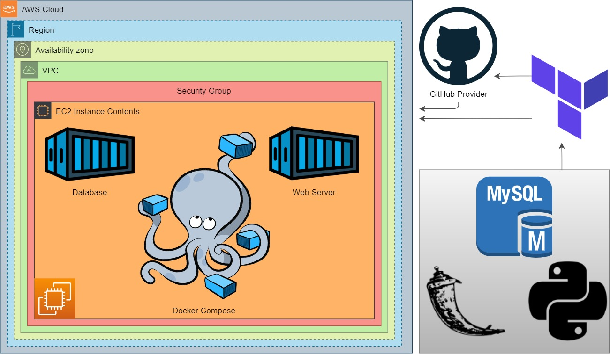
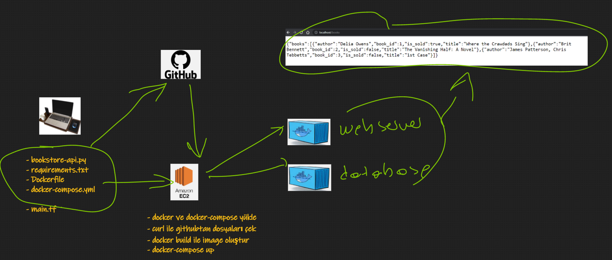
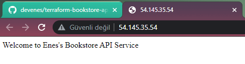
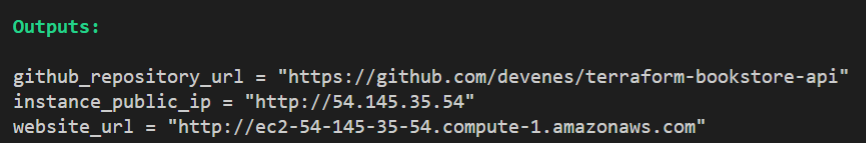

<h1 align="center">Containerization of Python Flask Bookstore Web API with MySQL using Docker Compose and Terraform</h1>

<p align="center">
  
  
  
  
  
  <!--  -->
  <!--  -->
  <!--  -->
</p>

<hr>

<p align="center">
  <a href="#dart-about">About</a> &#xa0; | &#xa0; 
  <a href="#sparkles-Case-Study-Details">Case Study Details</a> &#xa0; | &#xa0;
  <a href="#rocket-technologies">Technologies</a> &#xa0; | &#xa0;
  <a href="#white_check_mark-requirements">Requirements</a> &#xa0; | &#xa0;
  <a href="#checkered_flag-starting">Starting</a> &#xa0; | &#xa0;
  <a href="#memo-license">License</a> &#xa0; | &#xa0;
  <a href="https://github.com/devenes" target="_blank">Author</a>
</p>

<br>

## :dart: About

Bookstore Web API Application aims to create a bookstore web service using Docker to have the understanding to dockerization of an application. The application code is to be deployed as a RESTful web service with Flask using Dockerfile and Docker Compose on AWS Elastic Compute Cloud (EC2) Instance using Terraform.

## Project Architecture



## :sparkles: Case Study Details

- Your team has started working on a project to create a `Bookstore` Application as Web Service.

- Software Developers in your team have already developed first version of `Bookstore` application. They have designed a database to keep book records with following fields.

  - book_id: unique identifier for books, type is numeric.

  - title: title of the book, type is string.

  - author: author of the book. type is string.

  - is_sold: book availability status, type is boolean.

- Your teammates also created the RESTful web service as given in [Bookstore API](./bookstore-api.py) using Python Flask Framework. Below table shows how the HTTP methods are designed to affect the given resources identified by URIs.

| HTTP Method | Action                              | Example                                                                                             |
| ----------- | ----------------------------------- | --------------------------------------------------------------------------------------------------- |
| `GET`       | Obtain information about a resource | http://[ec2-hostname]/books (retrieves list of all books)                                           |
| `GET`       | Obtain information about a resource | http://[ec2-hostname]/books/123 (retrieves book with id=123)                                        |
| `POST`      | Create a new resource               | http://[ec2-hostname]/books (creates a new book, from data provided with the request)               |
| `PUT`       | Update a resource                   | http://[ec2-hostname]/books/123 (updates the book with id=123, from data provided with the request) |
| `DELETE`    | Delete a resource                   | http://[ec2-hostname]/books/123 (delete the book with id=123)                                       |

- You are, as a cloud engineer, requested to deploy the app in the development environment on a Docker Machine on AWS EC2 Instance using Terraform to showcase your project. To do that you need to;

  - Get the app code from GitHub repo of your team.

  - Create docker image using the `Dockerfile`.

  - Deploy the app using `docker compose`. To do so;

    - Create a database service using MySQL.

    - Configure the app service to run on `port 80`.

    - Use a custom network for the services.

- In the development environment, you can configure your Terraform config file using the followings,

  - The application should be created with new AWS resources.

  - The application should run on Amazon Linux 2 EC2 Instance

  - EC2 Instance type can be configured as `t2.micro`.

  - Instance launched by Terraform should be tagged `Web Server of Bookstore`

  - The Web Application should be accessible via web browser from anywhere.

  - The Application files should be downloaded from Github repo and deployed on EC2 Instance using user data script within Terraform configuration file.

  - Bookstore Web API URL should be given as output byTerraform, after the resources created.

## :rocket: Technologies

The following tools were used in this project:

- [Python](https://www.python.org/)
- [Docker](https://www.docker.com/)
- [Docker Compose](https://docs.docker.com/compose/overview/)
- [Terraform](https://www.terraform.io/)
- [Flask](https://flask.palletsprojects.com/)
- [AWS](https://aws.amazon.com/)

## :white_check_mark: Requirements

Before starting :checkered_flag:, you need to have [Git](https://git-scm.com), [Docker](https://www.docker.com/) and [Terraform](https://www.terraform.io/) installed on your machine.

## :checkered_flag: Starting

```bash
# Clone this project
git clone https://github.com/devenes/terraform-containerization-bookstore-api

# Access
cd terraform-containerization-bookstore-api

# Initialize terraform
terraform init

# Apply terraform
terraform apply -auto-approve
```

- To showcase your projects REST functions, use `curl` command for each HTTP methods namely, `GET`, `POST`, `PUT`, `DELETE`.



### GET

```bash
curl --request GET \
--url 'http://ec2-52-91-247-19.compute-1.amazonaws.com/books' \
--header 'content-type: application/json'
```

### POST

```bash
curl --request POST \
--url 'http://ec2-52-91-247-19.compute-1.amazonaws.com/books' \
--header 'content-type: application/json' \
--data '{"author":"Paulo Coelho", "title":"The Alchemist", "is_sold":true}'
```

```bash
curl --request POST \
--url 'http://ec2-52-91-247-19.compute-1.amazonaws.com/books' \
--header 'content-type: application/json' \
--data '{"author":"Gabriel Garcia Marquez", "title":"One Hundred Years of Solitude", "is_sold":true}'
```

```bash
curl --request POST \
--url 'http://ec2-52-91-247-19.compute-1.amazonaws.com/books' \
--header 'content-type: application/json' \
--data '{"author":"Harper Lee", "title":"To Kill a Mockingbird", "is_sold":true}'
```

### PUT

```bash
curl --request PUT \
--url 'http://ec2-52-91-247-19.compute-1.amazonaws.com/books/3' \
--header 'content-type: application/json' \
--data '{"author":"Jose Rodrigues dos Santos", "title":"A Formula de Deus", "is_sold":true}'
```

### DELETE

```bash
curl --request DELETE \
--url 'http://ec2-52-91-247-19.compute-1.amazonaws.com/books/2' \
--header 'content-type: application/json'
```

## Expected Outcome

- ### API Service Output

  

- ### Terraform Outputs

  

### At the end of the project, following topics are to be covered;

- MySQL Database Configuration

- Bash scripting

- Docker Images

- Docker Compose

- AWS EC2 Service

- AWS Security Group Configuration

- Terraform Configuration with AWS

- Git & Github for Version Control System

### At the end of the project, you will be able to;

- configure connection to the `MySQL` database.

- build a Docker image.

- configure Docker Compose to run Python Flask app.

- improve bash scripting skills using `user data` section in Terraform to install and setup web application on EC2 Instance

- configure AWS EC2 Instance and Security Groups.

- configure Terraform files to use AWS Resources.

- use git commands (push, pull, commit, add etc.) and Github as Version Control System.

- run the web application on AWS EC2 instance using the GitHub repo as codebase.

## Resources

- [Representational State Transfer](https://en.wikipedia.org/wiki/Representational_state_transfer)

- [Terraform AWS Provider Documentaion](https://registry.terraform.io/providers/hashicorp/aws/latest/docs)

- [Dockerfile](https://docs.docker.com/engine/reference/builder/#dockerfile)

- [Docker Compose](https://docs.docker.com/compose/overview/)

- [Python Image](https://hub.docker.com/_/python)

- [MySQL Image](https://hub.docker.com/_/mysql/)

- [pip Doc](https://pip.pypa.io/en/stable/cli/pip_install/#install-requirement)

- [Flask MySQL](https://flask-mysql.readthedocs.io/en/stable/)

## :memo: License

This project is under license from MIT. For more details, see the [LICENSE](LICENSE) file.

Made with :heart: by <a href="https://github.com/devenes" target="_blank">devenes</a>

&#xa0;

<a href="#top">Back to top</a>
